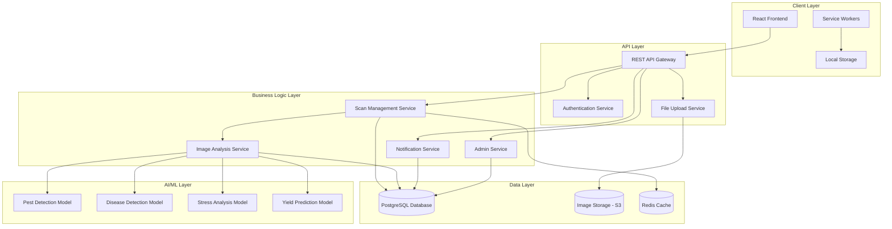

# Design Document: Farmer Drone Scan Platform

## Overview

The Farmer Drone Scan Platform extends the existing AgriVistaar application with comprehensive drone-based crop monitoring capabilities. The system integrates seamlessly with the current React/Vite architecture, leveraging existing authentication, internationalization, and UI patterns while adding new features for scan booking, image analysis, and administrative management.

The platform follows a client-server architecture where the React frontend communicates with a backend API for data persistence, image processing, and AI-powered crop health analysis. The design emphasizes mobile-first responsive design, offline capability for rural connectivity, and integration with existing AgriVistaar features like the profit calculator and mandi price intelligence.

## Architecture

### High-Level Architecture



### Technology Stack

**Frontend:**
- React 19.2.0 with React Router DOM 7.11.0
- Vite 7.2.4 for build tooling
- Tailwind CSS 3.4.19 for styling
- Axios 1.13.2 for HTTP requests
- Lucide React 0.562.0 for icons
- date-fns 4.1.0 for date handling
- Workbox for service worker and offline support

**Backend (Recommended):**
- Node.js with Express.js or Fastify
- PostgreSQL for relational data
- AWS S3 or compatible object storage for images
- Redis for caching and session management
- JWT for authentication tokens

**AI/ML Pipeline:**
- Python-based microservice
- TensorFlow or PyTorch for model inference
- OpenCV for image preprocessing
- REST API interface for integration

### Integration Points

The platform integrates with existing AgriVistaar features:

1. **Field Data Integration**: Reuses existing field definitions from `src/data/fields.js`
2. **Language Context**: Leverages `LanguageContext` for multi-language support
3. **Navigation**: Extends existing `App.jsx` routing structure
4. **Profit Calculator**: Links scan results to profit calculations
5. **Mandi Prices**: Cross-references health data with price intelligence
6. **Chat Assistant**: Enables queries about scan results

## Components and Interfaces

### Frontend Component Structure

```
src/
├── pages/
│   ├── farmer/
│   │   ├── ScanBooking.jsx          # Book new drone scans
│   │   ├── ScanHistory.jsx          # View past scans
│   │   ├── HealthReport.jsx         # Detailed health analysis
│   │   ├── FieldManagement.jsx      # Manage fields (enhanced)
│   │   └── Notifications.jsx        # View notifications
│   ├── admin/
│   │   ├── AdminDashboard.jsx       # Admin overview
│   │   ├── FarmerManagement.jsx     # Manage farmers
│   │   ├── ScanManagement.jsx       # Manage scan requests
│   │   ├── ImageUpload.jsx          # Upload drone images
│   │   └── Analytics.jsx            # Platform analytics
│   └── shared/
│       └── ImageViewer.jsx          # View drone images with overlays
├── components/
│   ├── scan/
│   │   ├── ScanRequestCard.jsx      # Display scan request
│   │   ├── ScanStatusBadge.jsx      # Status indicator
│   │   ├── HealthMetrics.jsx        # Health indicators
│   │   └── RecommendationCard.jsx   # Action recommendations
│   ├── admin/
│   │   ├── FarmerCard.jsx           # Farmer summary card
│   │   ├── AnalyticsChart.jsx       # Chart components
│   │   └── ScanRequestTable.jsx     # Scan request table
│   └── common/
│       ├── FileUploader.jsx         # Reusable file upload
│       ├── DatePicker.jsx           # Date selection
│       ├── StatusIndicator.jsx      # Generic status display
│       └── ConfirmDialog.jsx        # Confirmation dialogs
├── services/
│   ├── api.js                       # Axios instance configuration
│   ├── authService.js               # Authentication API calls
│   ├── scanService.js               # Scan-related API calls
│   ├── fieldService.js              # Field management API calls
│   ├── adminService.js              # Admin API calls
│   └── notificationService.js       # Notification API calls
├── hooks/
│   ├── useAuth.js                   # Authentication hook
│   ├── useScans.js                  # Scan data hook
│   ├── useFields.js                 # Field data hook
│   └── useNotifications.js          # Notifications hook
├── context/
│   ├── AuthContext.jsx              # Authentication state
│   └── NotificationContext.jsx      # Notification state
└── utils/
    ├── imageUtils.js                # Image processing utilities
    ├── dateUtils.js                 # Date formatting utilities
    └── validationUtils.js           # Form validation utilities
```

### API Endpoints

#### Authentication Endpoints

```
POST   /api/auth/register           # Register new user
POST   /api/auth/login              # Login user
POST   /api/auth/logout             # Logout user
POST   /api/auth/refresh            # Refresh JWT token
POST   /api/auth/forgot-password    # Request password reset
POST   /api/auth/reset-password     # Reset password with token
GET    /api/auth/me                 # Get current user info
```

#### Field Management Endpoints

```
GET    /api/fields                  # Get all fields for user
POST   /api/fields                  # Create new field
GET    /api/fields/:id              # Get field details
PUT    /api/fields/:id              # Update field
DELETE /api/fields/:id              # Delete field
GET    /api/fields/:id/scans        # Get scan history for field
```

#### Scan Request Endpoints

```
GET    /api/scans                   # Get all scans for user
POST   /api/scans                   # Create scan request
GET    /api/scans/:id               # Get scan details
PUT    /api/scans/:id               # Update scan request
DELETE /api/scans/:id               # Cancel scan request
GET    /api/scans/:id/report        # Get health report
GET    /api/scans/:id/images        # Get scan images
POST   /api/scans/:id/images        # Upload images for scan
```

#### Admin Endpoints

```
GET    /api/admin/farmers           # Get all farmers
GET    /api/admin/farmers/:id       # Get farmer details
PUT    /api/admin/farmers/:id       # Update farmer
DELETE /api/admin/farmers/:id       # Deactivate farmer
GET    /api/admin/scans             # Get all scan requests
PUT    /api/admin/scans/:id/status  # Update scan status
GET    /api/admin/analytics         # Get platform analytics
POST   /api/admin/scans/:id/analyze # Trigger analysis manually
```

#### Notification Endpoints

```
GET    /api/notifications           # Get user notifications
PUT    /api/notifications/:id/read  # Mark notification as read
PUT    /api/notifications/read-all  # Mark all as read
DELETE /api/notifications/:id       # Delete notification
```

### Data Models

#### User Model

```typescript
interface User {
  id: string;
  name: string;
  email: string;
  phone: string;
  passwordHash: string;
  role: 'farmer' | 'admin';
  district: string;
  state: string;
  language: string;
  isActive: boolean;
  createdAt: Date;
  updatedAt: Date;
}
```

#### Field Model

```typescript
interface Field {
  id: string;
  userId: string;
  name: string;
  location: {
    latitude: number;
    longitude: number;
  };
  areaSizeAcres: number;
  currentCrop: string;
  plantingDate: Date;
  expectedHarvestDate: Date;
  createdAt: Date;
  updatedAt: Date;
}
```

#### Scan Request Model

```typescript
interface ScanRequest {
  id: string;
  userId: string;
  fieldId: string;
  status: 'pending' | 'confirmed' | 'completed' | 'cancelled';
  scheduledDate: Date;
  completedDate?: Date;
  cropStage: 'early_vegetative' | 'mid_season' | 'pre_harvest';
  notes?: string;
  cancelReason?: string;
  createdAt: Date;
  updatedAt: Date;
}
```

#### Drone Image Model

```typescript
interface DroneImage {
  id: string;
  scanId: string;
  imageUrl: string;
  thumbnailUrl: string;
  fileSize: number;
  format: string;
  captureDate: Date;
  metadata: {
    altitude?: number;
    resolution?: string;
    gpsCoordinates?: {
      latitude: number;
      longitude: number;
    };
  };
  uploadedBy: string;
  uploadedAt: Date;
}
```

#### Health Report Model

```typescript
interface HealthReport {
  id: string;
  scanId: string;
  fieldId: string;
  analysisDate: Date;
  overallHealth: 'healthy' | 'at_risk' | 'critical';
  confidenceScore: number;
  pestDetection: {
    detected: boolean;
    pestType?: string;
    severity: 'low' | 'medium' | 'high';
    affectedAreaPercentage: number;
    locations: Array<{
      x: number;
      y: number;
      radius: number;
    }>;
  };
  diseaseDetection: {
    detected: boolean;
    diseaseType?: string;
    severity: 'low' | 'medium' | 'high';
    affectedAreaPercentage: number;
    locations: Array<{
      x: number;
      y: number;
      radius: number;
    }>;
  };
  waterStress: {
    detected: boolean;
    stressType?: 'drought' | 'waterlogging';
    severity: 'low' | 'medium' | 'high';
    affectedAreaPercentage: number;
  };
  nutrientStress: {
    detected: boolean;
    nutrientType?: 'nitrogen' | 'phosphorus' | 'potassium' | 'other';
    severity: 'low' | 'medium' | 'high';
    affectedAreaPercentage: number;
  };
  yieldPrediction: {
    estimatedYieldPerAcre: number;
    confidenceRange: {
      min: number;
      max: number;
    };
  };
  recommendations: Recommendation[];
  createdAt: Date;
}
```

#### Recommendation Model

```typescript
interface Recommendation {
  id: string;
  reportId: string;
  priority: 'urgent' | 'high' | 'medium' | 'low';
  category: 'pest_control' | 'disease_treatment' | 'irrigation' | 'fertilization';
  title: string;
  description: string;
  actionSteps: string[];
  estimatedCost?: number;
  expectedTimeline?: string;
  potentialYieldImpact?: string;
  createdAt: Date;
}
```

#### Notification Model

```typescript
interface Notification {
  id: string;
  userId: string;
  type: 'scan_confirmed' | 'scan_completed' | 'report_ready' | 'critical_issue' | 'scan_cancelled';
  title: string;
  message: string;
  relatedEntityType?: 'scan' | 'field' | 'report';
  relatedEntityId?: string;
  isRead: boolean;
  createdAt: Date;
}
```

## Correctness Properties

*A property is a characteristic or behavior that should hold true across all valid executions of a system—essentially, a formal statement about what the system should do. Properties serve as the bridge between human-readable specifications and machine-verifiable correctness guarantees.*

